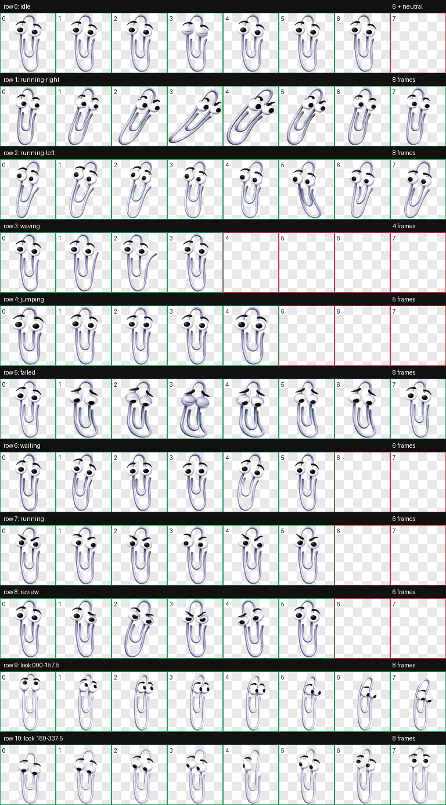

# Clippy - Desktop Pet for ChatGPT App / Codex

Ready-to-use visuals of nostalgic desktop pet Clippy

<!-- Centering the first photo using a div tag -->
<div align="center">
  
</div>


## 1) Installation 
**Dafault path:**
```bash
C:\Users\[YOUR_USERNAME]\.codex\pets\clippy
```
The exact path depends on where Codex is installed on your system.
## 2) Rerun the ChatGPT app
Choose clippy in pet menu 

# Sprite sheet
Detailing all the available animation frames



<p align="center" style="color: red;">
📎<strong>ENJOY!</strong>📎
</p>
